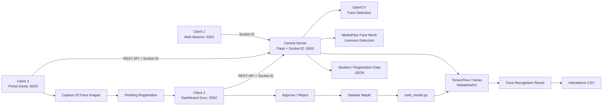

# Face Recognition Attendance System

Sistem absensi berbasis **Face Recognition**, **Machine Learning**, dan **Liveness Detection** yang dikembangkan sebagai **proyek penelitian jurnal akademik**. Proyek ini bukan tugas akhir.

Sistem dirancang dengan satu **central server** dan tiga client terpisah:

1. **Client Absensi** — digunakan untuk melakukan absensi menggunakan kamera.
2. **Dashboard Guru** — digunakan untuk monitoring kehadiran dan approval registrasi wajah siswa.
3. **Portal Siswa** — digunakan untuk autentikasi dan registrasi wajah secara mandiri.

Face recognition menggunakan model **MobileNetV2** berbasis transfer learning. Untuk membantu mencegah penggunaan foto statis, sistem juga menerapkan **liveness detection berbasis kedipan mata** menggunakan MediaPipe Face Mesh.

> **Status:** prototipe penelitian/akademik. Sistem belum ditujukan untuk penggunaan produksi dan masih menggunakan penyimpanan file lokal serta konfigurasi development.

## Arsitektur Sistem



## Cara Kerja Sistem

### 1. Registrasi siswa

Siswa melakukan registrasi melalui **Portal Siswa**. Data siswa divalidasi oleh central server sebelum proses pengambilan wajah dimulai.

Saat registrasi:

- sistem membuat sesi registrasi melalui Socket.IO;
- MediaPipe Face Mesh memantau landmark mata;
- siswa diminta berkedip **2 kali** sebagai verifikasi liveness;
- setelah liveness berhasil, sistem mengambil hingga **20 gambar wajah**;
- gambar disimpan sementara di folder pending;
- permintaan registrasi dikirim ke Dashboard Guru untuk approval.

Jika guru menyetujui registrasi, data siswa ditambahkan ke database lokal dan foto wajah dipindahkan ke dataset yang digunakan untuk training model.

### 2. Training model wajah

Training dilakukan melalui `train_model.py` menggunakan **MobileNetV2 pretrained ImageNet** sebagai base model.

Pipeline training:

- input image `224 x 224`;
- normalisasi pixel;
- data augmentation berupa rotation, zoom, width shift, dan height shift;
- pembagian dataset training dan validation menggunakan `validation_split=0.2`;
- base MobileNetV2 dibekukan;
- classification head menggunakan `GlobalAveragePooling2D`, Dense, dan Dropout;
- optimizer Adam dengan learning rate `0.0001`;
- model disimpan sebagai `models/face_recognition_model.h5`;
- mapping class disimpan ke `models/face_encodings.pkl`.

Setelah ada siswa baru yang disetujui, model perlu dilatih kembali agar kelas wajah baru masuk ke model recognition.

### 3. Proses absensi

Pada Client Absensi, frame kamera dikirim ke central server melalui Socket.IO.

Urutan prosesnya:

1. Frame kamera diterima central server.
2. MediaPipe Face Mesh menghitung **Eye Aspect Ratio (EAR)** untuk mendeteksi kedipan.
3. Pengguna harus berkedip minimal 2 kali agar dianggap sebagai wajah hidup.
4. OpenCV Haar Cascade mendeteksi area wajah.
5. Wajah di-resize menjadi `224 x 224` dan dinormalisasi.
6. Model MobileNetV2 melakukan klasifikasi identitas.
7. Prediksi diterima jika confidence melewati threshold recognition.
8. Server mencari data siswa berdasarkan `student_id`.
9. Sistem mengecek apakah siswa sudah melakukan absensi pada hari yang sama.
10. Jika belum, data kehadiran dicatat dan Dashboard Guru menerima update secara real-time.

Record absensi menyimpan informasi seperti waktu, NIS, nama, kelas, status, metode, dan confidence recognition.

## Liveness Detection

Liveness detection menggunakan **MediaPipe Face Mesh** dan pendekatan Eye Aspect Ratio.

Sistem melacak landmark mata kiri dan kanan, lalu menghitung perubahan rasio bukaan mata. Kedipan dianggap valid ketika mata tertutup selama jumlah frame minimum tertentu dan kembali terbuka.

Pada implementasi saat ini:

- `EAR_THRESHOLD = 0.25`
- minimum closed frames = `2`
- liveness dianggap berhasil setelah **2 kedipan**

Pendekatan ini membantu membedakan wajah langsung dengan gambar statis sederhana, tetapi **bukan sistem anti-spoofing tingkat produksi**.

## Tiga Client

| Client | Port | Fungsi |
| --- | ---: | --- |
| Central Server | `5000` | REST API, Socket.IO, face recognition, liveness, database |
| Client 1 — Absensi | `5001` | Kamera dan proses absensi siswa |
| Client 2 — Guru | `5002` | Monitoring absensi dan approval registrasi |
| Client 3 — Siswa | `5003` | Portal registrasi wajah siswa |

## Teknologi

| Bagian | Teknologi |
| --- | --- |
| Backend | Python, Flask |
| Realtime Communication | Flask-SocketIO |
| Machine Learning | TensorFlow, Keras, MobileNetV2 |
| Computer Vision | OpenCV |
| Liveness Detection | MediaPipe Face Mesh, SciPy |
| Data Processing | NumPy, Pandas |
| Frontend | HTML, CSS, JavaScript |
| API | REST API, JSON |
| Storage | JSON, CSV, file image lokal |

## Struktur Proyek

```text
face-recognition/
├── README.md
└── PROJECT ABSEN/
    ├── server.py
    ├── train_model.py
    ├── client1/
    │   ├── app.py
    │   └── absensi.html
    ├── client2/
    │   ├── app.py
    │   └── guru.html
    ├── client3/
    │   ├── app.py
    │   └── siswa.html
    └── database/
```

Saat aplikasi berjalan, server juga menggunakan folder berikut:

```text
PROJECT ABSEN/
├── dataset/
│   ├── faces/
│   └── pending/
└── models/
    ├── face_recognition_model.h5
    └── face_encodings.pkl
```

## Instalasi

Masuk ke folder project:

```bash
cd "PROJECT ABSEN"
```

Install dependency utama:

```bash
pip install flask flask-socketio flask-cors opencv-python mediapipe tensorflow numpy scipy pandas
```

> Versi dependency belum dikunci dalam `requirements.txt`, sehingga kompatibilitas dapat bergantung pada versi Python dan library yang digunakan.

## Menjalankan Sistem

### 1. Training model

Pastikan dataset wajah sudah tersedia di `dataset/faces/`, kemudian jalankan:

```bash
python train_model.py
```

### 2. Jalankan central server

```bash
python server.py
```

Central server berjalan di:

```text
http://localhost:5000
```

### 3. Jalankan Client Absensi

Buka terminal baru:

```bash
cd client1
python app.py
```

Akses:

```text
http://localhost:5001
```

### 4. Jalankan Dashboard Guru

Buka terminal baru:

```bash
cd client2
python app.py
```

Akses:

```text
http://localhost:5002
```

### 5. Jalankan Portal Siswa

Buka terminal baru:

```bash
cd client3
python app.py
```

Akses:

```text
http://localhost:5003
```

## Beberapa Endpoint Central Server

| Method | Endpoint | Fungsi |
| --- | --- | --- |
| `GET` | `/api/students` | Mengambil daftar siswa |
| `GET` | `/api/students/<nis>` | Mengambil data satu siswa |
| `GET` | `/api/attendance` | Mengambil data absensi |
| `GET` | `/api/attendance/today` | Mengambil absensi hari ini |
| `GET` | `/api/stats` | Statistik kehadiran |
| `GET` | `/api/pending-registrations` | Daftar registrasi yang menunggu approval |
| `POST` | `/api/approve-registration/<request_id>` | Menyetujui registrasi wajah |
| `POST` | `/api/reject-registration/<request_id>` | Menolak registrasi wajah |
| `POST` | `/api/auth/authenticate-student` | Autentikasi siswa berdasarkan NIS dan nama |
| `POST` | `/api/auth/login-teacher` | Login guru |

Selain REST API, frame kamera dan event realtime diproses melalui **Socket.IO**.

## Penyimpanan Data

Prototype ini menggunakan file lokal:

- `database/students.json` — data siswa yang telah disetujui;
- `database/students_master.json` — data master siswa;
- `database/teachers.json` — data guru;
- `database/pending_registrations.json` — registrasi yang menunggu approval;
- `database/attendance.csv` — riwayat absensi;
- `dataset/faces/` — dataset wajah yang telah disetujui;
- `dataset/pending/` — gambar wajah sementara sebelum approval.

## Catatan Keamanan dan Pengembangan

Repository ini merupakan prototype akademik. Beberapa bagian kode masih menggunakan konfigurasi development, contoh data, dan credential dummy/hardcoded. Sebelum digunakan di lingkungan nyata, sebaiknya:

- pindahkan `SECRET_KEY` dan credential ke environment variable;
- hash password, bukan menyimpan plaintext;
- batasi CORS ke origin yang diperlukan;
- gunakan database produksi;
- tambahkan autentikasi dan authorization yang lebih kuat;
- gunakan HTTPS;
- terapkan proteksi data biometrik dan kebijakan privasi;
- gunakan anti-spoofing/liveness yang lebih kuat untuk deployment nyata;
- jangan commit dataset wajah atau data pribadi pengguna ke repository publik.

## Tujuan Proyek

Proyek ini dibuat untuk mengeksplorasi integrasi **Machine Learning, Computer Vision, liveness detection, realtime communication, dan web application** dalam sistem absensi berbasis wajah sebagai bagian dari **penelitian jurnal akademik**.

Fokus utama project adalah membangun alur lengkap mulai dari registrasi wajah, approval, training model, verifikasi liveness, pengenalan wajah, pencatatan kehadiran, hingga monitoring melalui dashboard guru.
